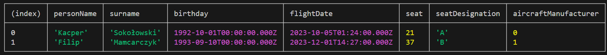

# Import Export Modules exercise

This is exercise based on the PL tutorial on imports, exports and modules in JS (https://www.youtube.com/watch?v=a_SR7601eVU)

## For developers

Run file in Node using command <code>node index.js</code>

## Starting point

## Finished exercise
